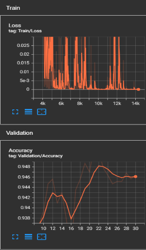
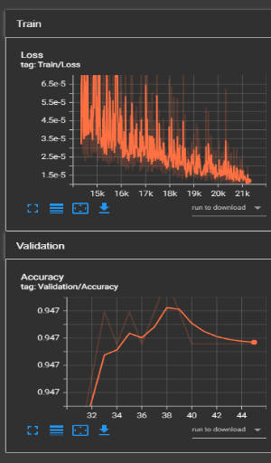
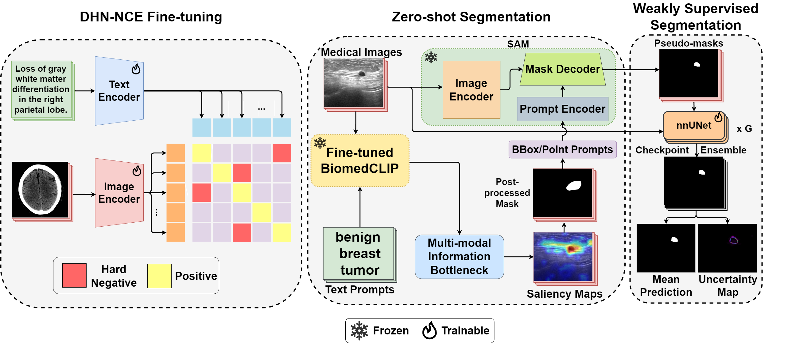
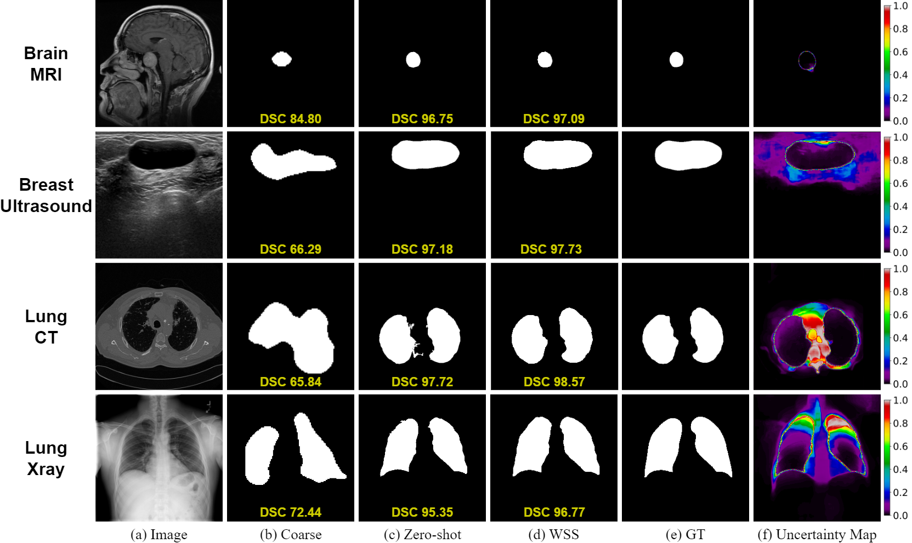

# SEMANTIC SEGMENTATION AND CLASSIFICATION WITH COVID-19_Radiography_Dataset 

---
- Ứng dụng mô hình classification và segmentation để xử lý ảnh X-ray với COVID-19_Radiography_Dataset
- Link dataset: https://www.kaggle.com/datasets/tawsifurrahman/covid19-radiography-database

## Classification:

---
- Sử dụng model ViT-B16 để phân loại ảnh x-ray
- Link repository: 
  - https://github.com/google-research/vision_transformer
### Pipeline của model:


---
### Accuracy:
### 1. ViT_B16:
- Train lần 1 với 100 epochs:
#### 
- Train lần 2 với 50 epochs: 
####  

#### - Accuracy giao động của validation giao động ở `0.9444` - `0.947`
#### - Cả 2 lần train đều bắt đầu overfitting từ epoch `40`

### 2. ResNet50
- Train 80 epochs:
#### 

### 3. EfficientNet_B0:
- Train 80 epochs:
#### 

### 4. DenseNet_121:
- Train 80 epochs:
####   


---
### Report:
#### 1. ViT_B16:
```txt
                 precision    recall  f1-score   support

          COVID       0.98      0.98      0.98       723
   Lung_Opacity       0.95      0.91      0.92      1202
         Normal       0.94      0.97      0.95      2037
Viral_Pneumonia       0.98      0.96      0.97       269

       accuracy                           0.95      4231
      macro avg       0.96      0.95      0.96      4231
   weighted avg       0.95      0.95      0.95      4231
```

#### 2. ResNet50:
```txt
                 precision    recall  f1-score   support

          COVID       0.99      0.97      0.98       723
   Lung_Opacity       0.95      0.93      0.94      1203
         Normal       0.95      0.97      0.96      2039
Viral_Pneumonia       0.97      0.94      0.96       269

       accuracy                           0.95      4234
      macro avg       0.96      0.95      0.96      4234
   weighted avg       0.95      0.95      0.95      4234

```

#### 3. EfficientNet_B0:
```txt
                 precision    recall  f1-score   support

          COVID       0.99      0.96      0.97       723
   Lung_Opacity       0.95      0.92      0.94      1203
         Normal       0.94      0.97      0.96      2039
Viral_Pneumonia       0.98      0.97      0.97       269

       accuracy                           0.96      4234
      macro avg       0.97      0.96      0.96      4234
   weighted avg       0.96      0.96      0.96      4234

```

#### 4. DensetNet_121:
```txt
                 precision    recall  f1-score   support

          COVID       0.99      0.95      0.97       723
   Lung_Opacity       0.94      0.93      0.94      1203
         Normal       0.95      0.97      0.96      2039
Viral_Pneumonia       0.98      0.96      0.97       269

       accuracy                           0.95      4234
      macro avg       0.96      0.95      0.96      4234
   weighted avg       0.95      0.95      0.95      4234

```


---
### Confusion matrix of ViT_B16:


---
### Evaluation
- Models nhìn chung học khá tốt, accuracy trung bình từ `0.95` - `0.96`.
- COVID: Precision các models đều rất cao: `0.98` `0.99`, nhưng xét về recall cao để phủ F0 thì ViT làm tốt nhất `0.98`.
- Lung Opacity: Dù precision là `0.95`, recall chỉ đạt được khoảng `0.91` từ các models -> model có thể nhận dạng sai 1 vài trường hợp.
- Normal: Recall cao `0.97`, cho thấy model phát hiện trường hợp bình thường nhiều hơn so với chính xác -> khá nguy hiểm.
- Viral_Pneumonia: Precision và recall đều rất cao, cao nhất `0.99` , model học rất tốt trong việc phân biệt virus viêm phổi và các bệnh khác.

#### Tổng quan, model có hiệu suất, accuracy rất tốt và độ chính xác cao.

---
### Test
1. COVID: 
#### 
2. Lung Opacity:
#### 
3. Normal:
#### 
4. Viral_Pneumonia:
#### 
---
## Segmentation:

---
- Sử dụng model MedCLIP-SAMv2 do HealthX-Lab nghiên cứu để phân đoạn ảnh x-ray
- Link repository: https://github.com/HealthX-Lab/MedCLIP-SAMv2/tree/main

### Framework


### Sample segmentation results
