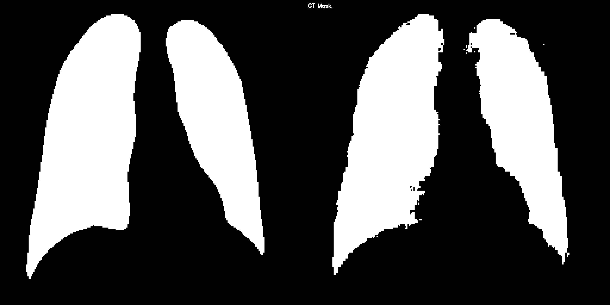
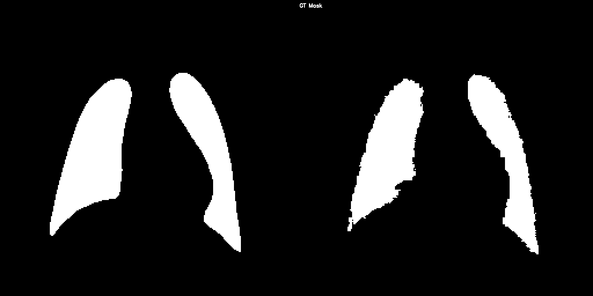

# SEGMENT CHEST-XRAY IMAGE WITH SEGMENT ANYTHING MODEL

---
- Using Segment Anything Model (SAM) with pretrain Vision Transformer - Base (ViT-b)
- Link dataset: [dataset](https://www.kaggle.com/datasets/tawsifurrahman/covid19-radiography-database)

---

## SEGMENT ANYTHING MODEL (SAM):
- Link repository:
  - https://github.com/facebookresearch/segment-anything
  - https://github.com/nidhinthomas-ai/XraySAM


### Configuration:
- Image Encoder: ViT-B
- Pretrained Weights: `model = SamModel.from_pretrained('facebook/sam-vit-base')`


---
### Accuracy:
I train this Model only 20 epochs:
- Training with 20 epochs:
#### 
#### 
#### 
#### 

- The Validation Masks of epoch 1 and epoch 20:
#### COVID:
#### 
#### 

#### Lung Opacity:
#### 
#### 

#### Viral Pneumonia:
#### 
#### 

#### Normal:
#### 
#### 


--- 
### Report:
```text
Train Loss: 0.08466800324497105, Train Acc: 0.9836245145780992, Train Dice: 0.9656995363574739, Train IoU: 0.9341708621596363
Val Loss: 0.07627292665598354, Val Acc: 0.9853176917380781, Val Dice: 0.9689471066448774, Val IoU: 0.9403690686185329
Best model saved with loss:  0.07627292665598354
```
---

### Evaluation:
- The model's performance is good, the Dice Loss and IoU are high
- However, the validation and test masks that model predicts still have `noise`

---

### Test:
         

### Overlay Mask:


---

## HOW TO USE:

### [My Checkpoint](https://drive.google.com/file/d/1joLU93uFNwqG-960ijy4rIf7C8o5IdQv/view?usp=sharing)

### 1. Prepare your dataset
- If your dataset doesn't have train, test, valid, you can use create_dataset.py to format dataset as below:
```text
data
├── COVID
│   ├── train_images           
│   ├── train_masks             
│   ├── val_images        
│   ├── val_masks         
│   ├── test_images       
│   └── test_masks        
│
├── Lung_Opacity
│   ├── train_images            
│   ├── train_masks            
│   ├── val_images        
│   ├── val_masks         
│   ├── test_images       
│   └── test_masks        
│
├── Normal
│   ├── train_images            
│   ├── train_masks            
│   ├── val_images        
│   ├── val_masks         
│   ├── test_images       
│   └── test_masks        
│
├── Viral_Pneumonia
│   ├── train_images            
│   ├── train_masks            
│   ├── val_images        
│   ├── val_masks         
│   ├── test_images       
│   └── test_masks           
```
#### source format: https://github.com/HealthX-Lab/MedCLIP-SAMv2
- If your dataset does not have this format, config in create_dataset.py
```text
if __name__ == '__main__':
    if not os.path.exists("data"):
        os.mkdir("data")
    data_path = "./dataset/COVID-19_Radiography_Dataset" # CHANGE WITH YOUR DATASET FOLDER
    output_path = "./data" # OUTPUT FOLDER
    categories = ["COVID", "Lung_Opacity", "Normal", "Viral_Pneumonia"] # CHANGE WITH YOUR CATEGORY
    for category in categories:
        create_dataset(data_path, output_path, category)
```

- Train my train.py file of SAM with pretrained ViT-b:

```text
# CHECK WITH THIS ARGS, YOU CAN CONFIG IT!!

def get_args():
    parser = ArgumentParser(description="COVID SEGMENTATION")
    
    parser.add_argument("--root", '-r', type=str, default="../data", help="root path")
    parser.add_argument("--batch_size", "-b",type=int, default=2, help="batch size")
    parser.add_argument("--epochs", "-e",type=int, default=10, help="number of epochs")
    parser.add_argument("--learning_rate", "-lr",type=float, default=1e-5, help="learning rate")
    parser.add_argument("--weight_decay", "-wd",type=float, default=0.0, help="weight decay")
    parser.add_argument("--num_workers", "-nw", type=int, default=6, help="number of workers")
    parser.add_argument("--image_size", '-i', type=int, default=512, help="image size")
    parser.add_argument("--logging", '-l', type=str, default="tensorboard", help="logging path")
    parser.add_argument("--checkpoint", '-c', type=str, default=None, help="checkpoint path")
    parser.add_argument("--save_models", "-sv", type=str, default="SAM_models", help="save path")
    args = parser.parse_args()
    return args
```
- Training:
```text
python train.py --root PATH/TO/YOUR/DATASET --save_models PATH/TO/YOUR/SAVE_POINT
```
- If you have a checkpoint of best_model.pt:
```text
python train.py --root PATH/TO/YOUR/DATASET --checkpoint PATH/TO/YOUR/best_model.pt
```
- If you want to continue your training:
```text
python train.py --root PATH/TO/YOUR/DATASET --checkpoint PATH/TO/YOUR/last_model.pt
```
- You can config `batch_size`, `epochs`, `num_workers`,... as your computer gpu.


# REFERENCES
- Thank You facebook-research and XraySam repository 
- Link facebook-research projects: https://github.com/facebookresearch
- Link XraySam: https://github.com/nidhinthomas-ai/XraySAM
